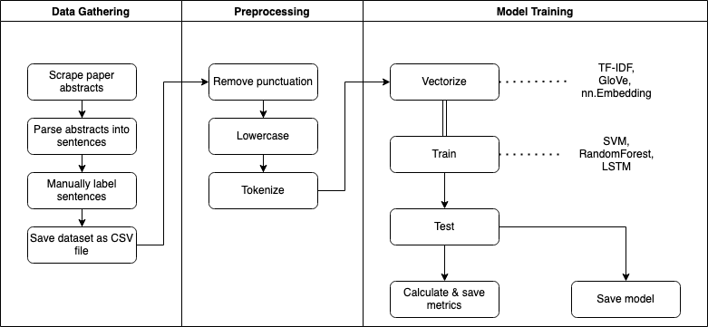
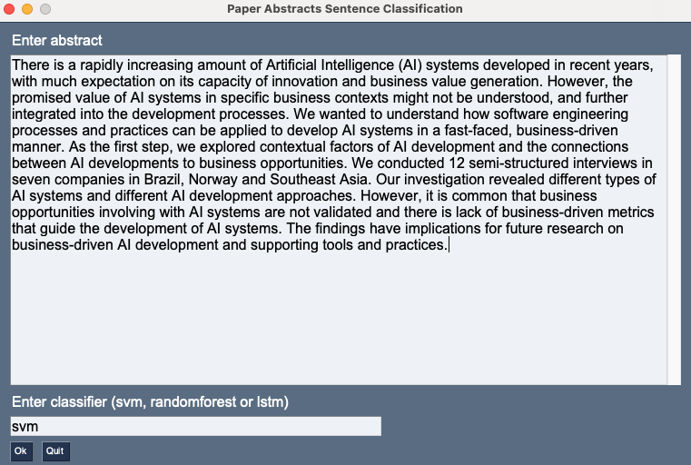
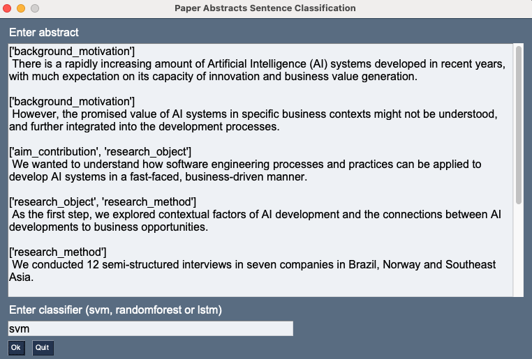

# Praktikum WfAM - Utku Erol

This document summarizes the work on the practical course project "An Automated Classification Approach of Software Engineering Papers". The goal is to make scientific papers more efficiently searchable by enriching the text with ML-generated metadata (labels). We aim to achieve this by classifying each sentence as e.g. "background and motivation" or "summary. 

To reduce complexity it has been decided to use only the abstract in the scope of this work. But the title and the conclusion parts of the papers can also be considered in future work. 

In this project the following ML techniques and implementations have been used for natural language processing: 

  1. Deep Learning (LSTM)   
     - Using PyTorch 
  2. Random Forest Classifier
     - Using sklearn 
  3. SVM Classifier 
     - Using sklearn

The diagram below summarizes this work visually: 



Each phase is documented in a separate page:

1. [Data Gathering](pages/data-gathering.md)
      
    First phase is data gathering where we scraped the internet for chosen paper abstracts and created a CSV dataset of labeled sentences. 

2. [Preprocessing](pages/preprocessing.md)
    
    Second phase is preprocessing to bring the dataset to a suitable format for classification algorithms. 
    
3. [Model Training](pages/models.md)
    
    Finally in the model training phase 3 different models are trained, evaluated and saved.   

For setup and run instructions see [how to run](#how-to-run). 

The final product is a simple GUI where users input a paper abstract and receive it labeled with the chosen classifier. GUI application is described [here](#gui).

## How to Run

First you need to install required libraries with the following command: 
```
pip install -r requirements.txt 
```

Alternatively if you're using [pipenv](https://realpython.com/pipenv-guide/): 
```
pipenv install
```

Preprocessing options, classifier model and extra options for LSTM network can be configured with the [main.py](main.py) script. For a quick configuration and training, the script parameters are also encapsulated as a [Makefile](Makefile). All you need to do to train a model and see/save the test results is to run a specific make-command: 

- ```make svm``` 
- ```make randomforest```
- ```make lstm-tfidf```

You can also manually run with ```python main.py [ARGS]``` whereas ARGS should be provided as below:

| Position | Argument                          | Values                  |
| -------- | --------------------------------- | ----------------------- |
| 1        | model                             | lstm, svm, randomforest |
| 2        | preprocessing: remove punctuation | 1, 0                    |
| 3        | preprocessing: lower case         | 1, 0                    |
| 4        | preprocessing: remove stop words  | 1, 0                    |
| 5        | preprocessing: stemming           | 1, 0                    |
| 6        | word encoding                     | tfidf                   |

To run unit tests run the make command: ```make test``` 

*Note:* Make sure to specify the dataset in the [source code](main.py). The default dataset is the [complete dataset](data/sentences_all.csv) which includes all 6 categories. If you wish to train on the merged categories dataset set the path accordingly.

### Docker Alternative

You can also build a docker image and start an experiment with the chosen classifier directly by: 

```$ docker-compose up svm|randomforest|lstm``` 

*Note:* This builds the docker image from existing source code which means the dataset specified in [main.py](main.py) is used for the training and evaluation. 

## GUI 

Train and save models under ```pretrained/modelname.obj``` by running:

 ```$ make svm|randomforest|lstm-tfidf```. 

Start the GUI application with: 

```$ python gui.py```. 


 
