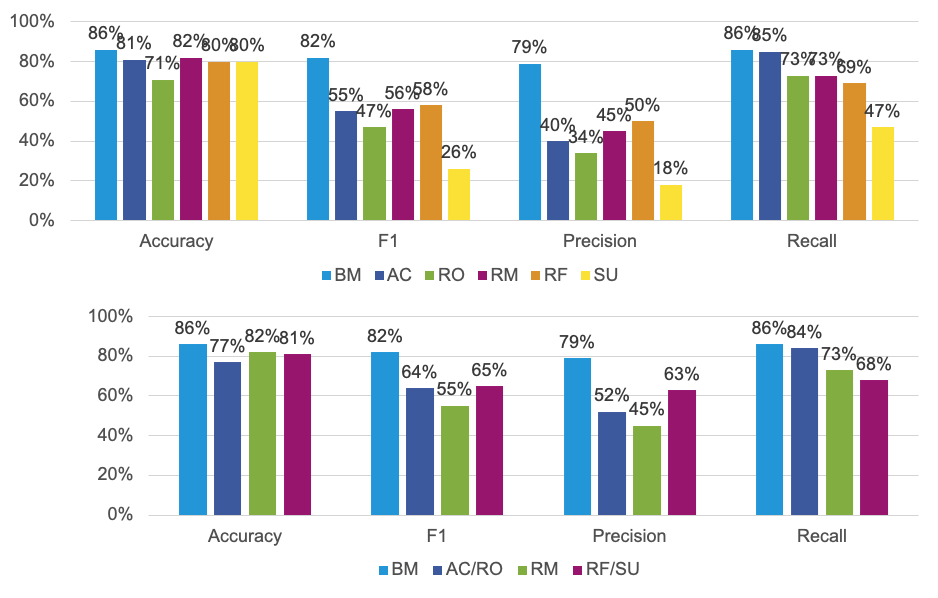
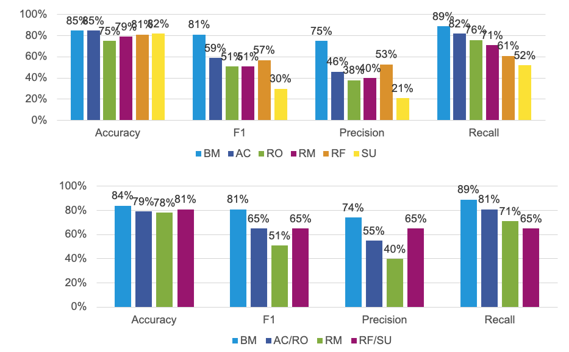
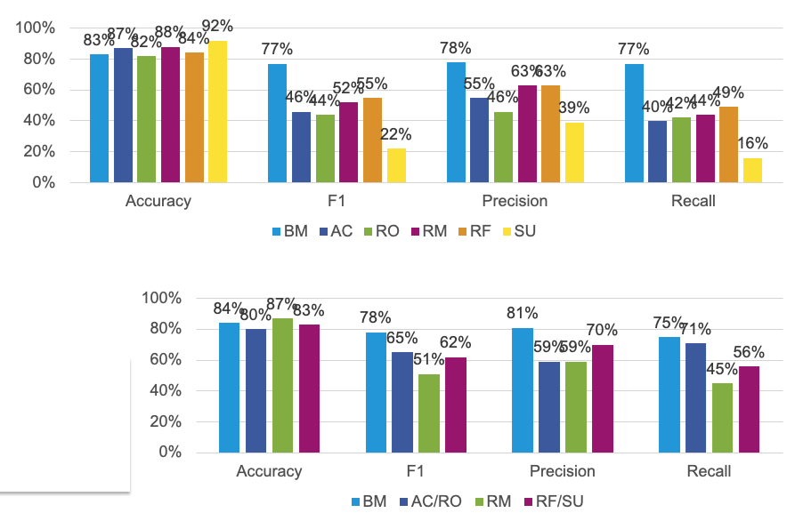

# Models


Classifier models and train/test executions are encapsulated in individual classes: [SVMClassifier](model/svm.py), [RandomForestClassifier](model/randomforest.py) and [LSTMClassifier](model/lstm.py). Each of these classes inherit from the same abstract class [Classifier](model/classifier.py). 


## Classifier Evaluation 

Since our dataset is imbalanced, some metrics are more important than others. Accuracy is not a good indicator for quality since simply classifying each sentence with no labels yields high accuracy due to the imbalanced nature of our data. Therefore recall metric is more relevant for the evaluation. Also precision isn't that important for the task as recall. Therefore F1 and F0,5 scores are not the most relevant measures either. So, F2 score and recall are the most indicative metrics for our task. 

But still, we gathered all of these metrics for each of the classifier models: 

- Metrics collected
  - Accuracy
    - Micro average
    - Macro average
  - Precision
    - Micro average
    - Macro average
  - Recall
    - Micro average
    - Macro average
  - F1 score
    - Micro average
    - Macro average
  - F0,5 score
    - Micro average
    - Macro average
  - F2 score
    - Micro average
    - Macro average
  - Training time
  - Test time 

Test results on the complete dataset are [here](../evaluation/results.csv).

Test results on the merged categories dataset are [here](../evaluation/results-4cats.csv).

*Note:* Testing has been carried out with 10-fold cross validation. To see implementation see [source code](../model/classifier.py#L63).

*Note:* Hardware used for tests has a ```2,3 GHz Dual-Core Intel Core i5``` CPU and ```8 GB 2133 MHz LPDDR3``` memory.

## SVM

- Implemented with sklearn
- Vectorize input with TF-IDF vectorizer
- Split data in a *per-class fashion* 
  - Train separate classifier for each target class
  - Predict per class 
- Use random under sampling
- Hyperparameter optimization with GridSearch performed [here](gridsearch.ipynb).  

- Results overview:
  
  

  - Better recall than precision in general (which is good)
  - F1 score distribution correlates with the overall label distribution as expected
  - Very poor results for summary without merging classes

## RandomForest

- Implemented with sklearn
- Vectorize input with TF-IDF vectorizer
- Split data in a *per-class fashion* 
  - Train separate classifier for each target class
  - Predict per class 
- Use random under sampling
- Hyperparameter optimization with GridSearch performed [here](gridsearch.ipynb).  
  
- Results overview:

  

  - Very similar results to SVM

## LSTM

- Implemented with PyTorch (with Lightning)
- Vectorize input with TF-IDF vectorizer
- Train and predict without splitting data in a *per-class fashion* 
  - Prediction for a target class depends on prediction for another target class
   
- Results overview: 

  

  - Better precision than recall in general (opposite of SVM and RandomForest)
    - But more balanced, less difference between precision and recall 
  - No real improvement in compare to SVM and RandomForest
    - But takes around 100 times longer to train! (see [detailed results](../evaluation/results.csv))
    - Probably due to lack of enough datapoints and misfit of TF-IDF vectors